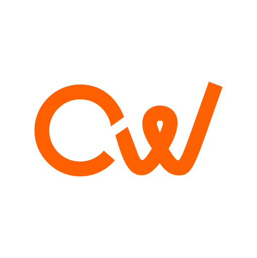
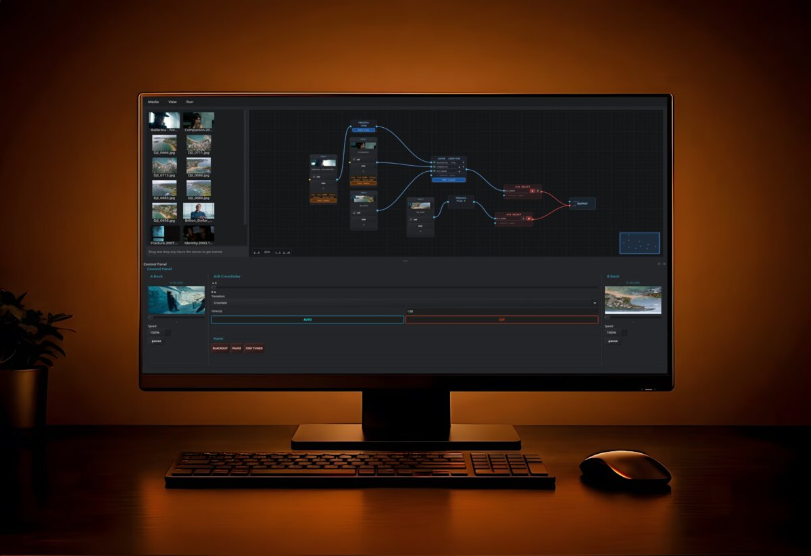
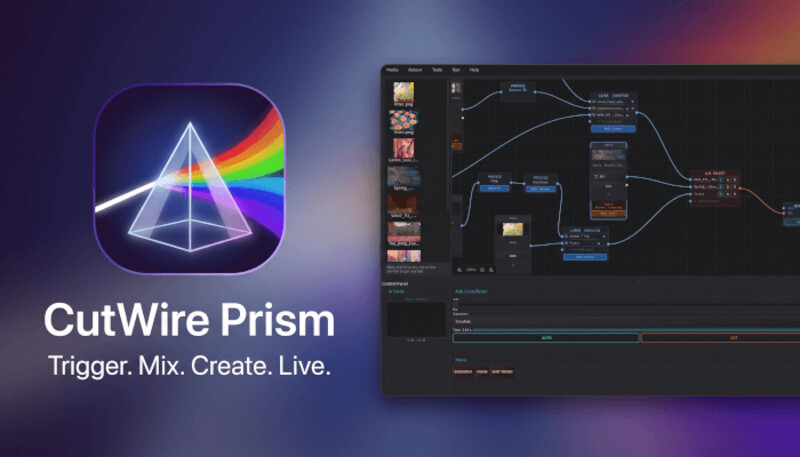
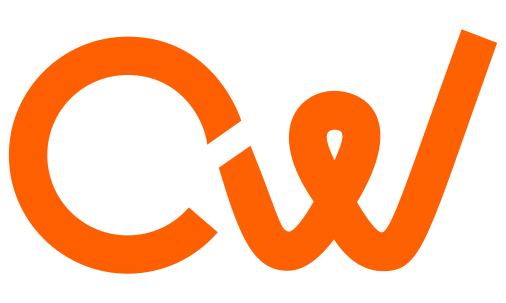

 

**A nonprofit organization building free, open-source creative software for everyone.**

[Website](https://cutwire.org) · [Documentation](https://docs.cutwire.org) · [Prism](https://github.com/CutWire-Studios/Prism)

 

---

## Mission

CutWire Studios is a **nonprofit** software organization. We build professional-grade creative tools with interfaces so intuitive that beginners feel confident from day one — while giving experts the depth and performance they demand.

Powerful technology shouldn't require a steep learning curve, a subscription, or a closed ecosystem. Our tools are free, open source, and released under GPLv3 so schools, communities, and creators can trust and extend what they run live.

  

## What we believe

- **Access over lock-in** — creative tools should be free to use, study, and improve
- **Clarity over complexity** — professional power without the manual
- **Calm under pressure** — interfaces built for operators running real shows and events
- **Open foundations** — Qt, FFmpeg, and GPLv3 so communities can depend on the stack

## Products

### [Prism](https://github.com/CutWire-Studios/Prism)

*Trigger. Mix. Create. Live.*

A beginner-friendly live media trigger and overlay tool built with Qt 6, FFmpeg, and OpenGL. Wire sources through a node graph, remove backgrounds live with AI, and crossfade decks — perfect for school events, small concerts, and sports.

  

| | |
|---|---|
| **Platforms** | macOS · Windows · Linux |
| **License** | GPLv3 |
| **Docs** | [docs.cutwire.org/prism](https://docs.cutwire.org/prism) |

**Highlights**

- Node graph canvas — Input → Process → Layer → A/B Select → Output
- Live A/B deck mixing with crossfades, wipes, slides, and 3D transitions
- AI background removal via ONNX Runtime
- Phone camera over WebRTC, GLSL shaders, HTML overlays, NDI & OBS integration

  

  

### More in the studio

| Project | Status | Description |
|---|---|---|
| [**Prism**](https://github.com/CutWire-Studios/Prism) | Public | Live media trigger & overlay tool |
| [**CutWire-Docs**](https://github.com/CutWire-Studios/CutWire-Docs) | Public | Documentation for CutWire software |
| Drift | In development | Beginner-friendly desktop video editor |

## Who it's for

| Audience | How CutWire helps |
|---|---|
| **Schools & education** | Instant highlight reels and overlays for assemblies, sports, and campus events |
| **Small venues & concerts** | Audio-reactive visuals and graphics without a steep learning curve |
| **Community media** | Free, open tools for sports broadcasts, theater, and local productions |
| **Creators & VJs** | A dark, operator-first interface with panic controls when it matters |

## Get involved

CutWire Studios is nonprofit and community-driven. Ways to help:

1. **Use and share** — run [Prism](https://github.com/CutWire-Studios/Prism) at your next event
2. **Report issues** — bugs and ideas make the tools better for everyone
3. **Contribute** — patches, translations, docs, and packaging are welcome
4. **Star & follow** — help others discover free creative software

## Links

| | |
|---|---|
| Website | [cutwire.org](https://cutwire.org) |
| Docs | [docs.cutwire.org](https://docs.cutwire.org) |
| Prism | [github.com/CutWire-Studios/Prism](https://github.com/CutWire-Studios/Prism) |
| Location | Sri Lanka |

---

  

  

nonprofit · open source · built for operators everywhere

[cutwire.org](https://cutwire.org)

